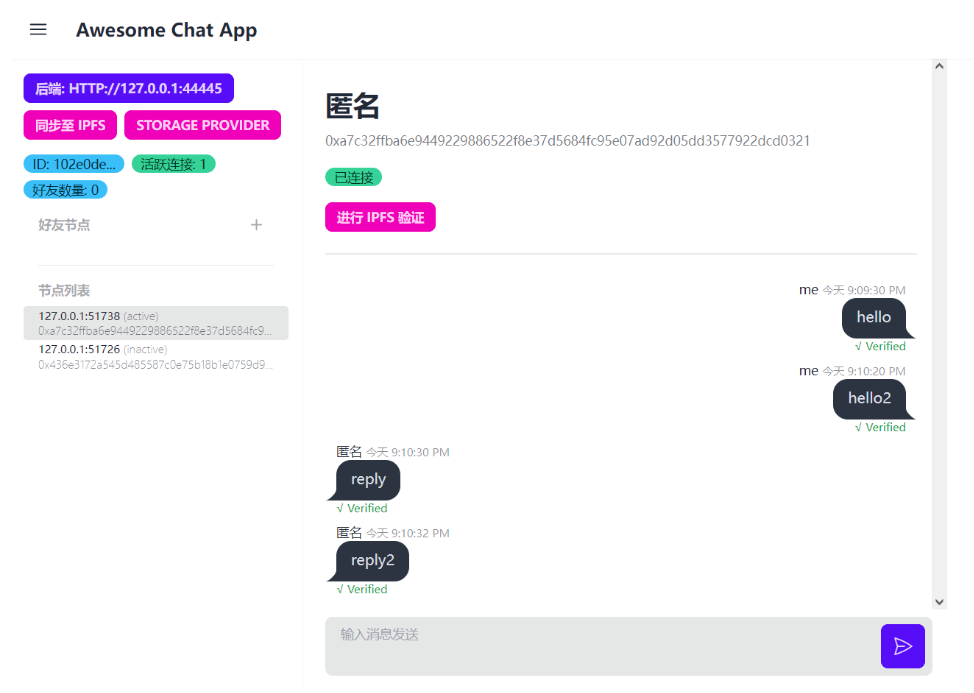
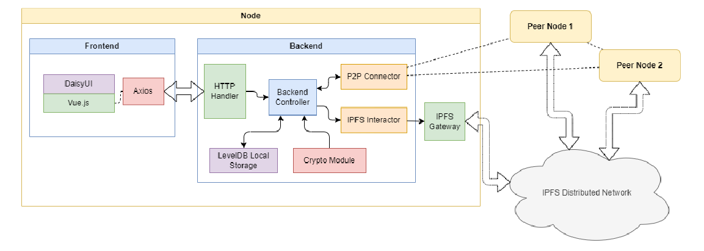
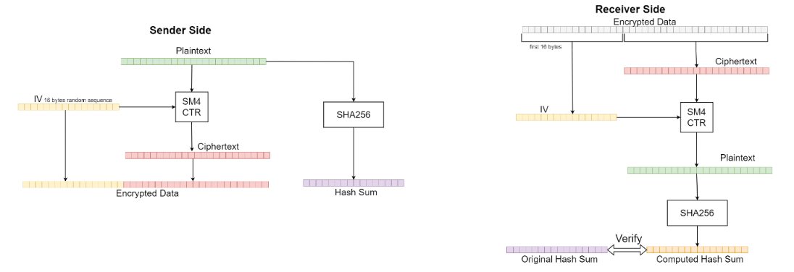

# dapp-chat

基于交换密钥的 P2P 即时消息通讯和链上加密存储实现

软件前端采用 Vue.js 框架和 DaisyUI 组件库进行实现，利用 Axios 网络库与后
端进行通信。软件后端使用 Golang 实现，可划分为 HTTP 处理模块、P2P 连接模块、IPFS 交互模块、LevelDB 本地存储模块和加密模块。

## 详细设计文档

[设计文档.pdf](./assets/设计文档.pdf)
